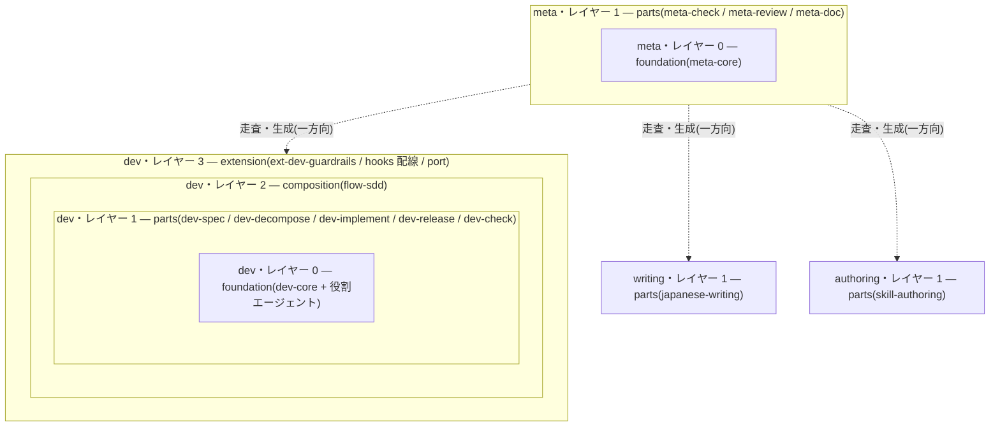
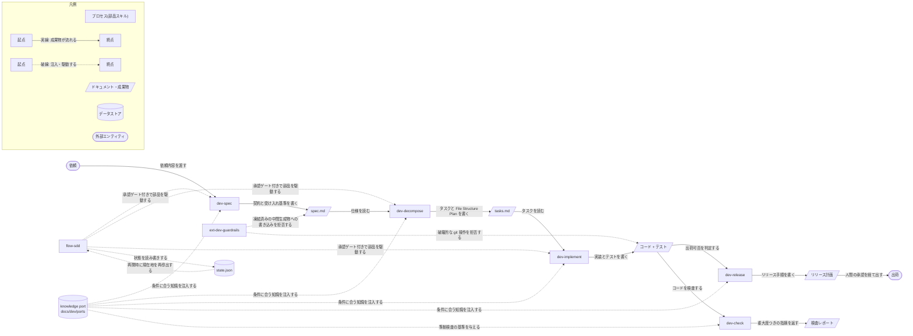
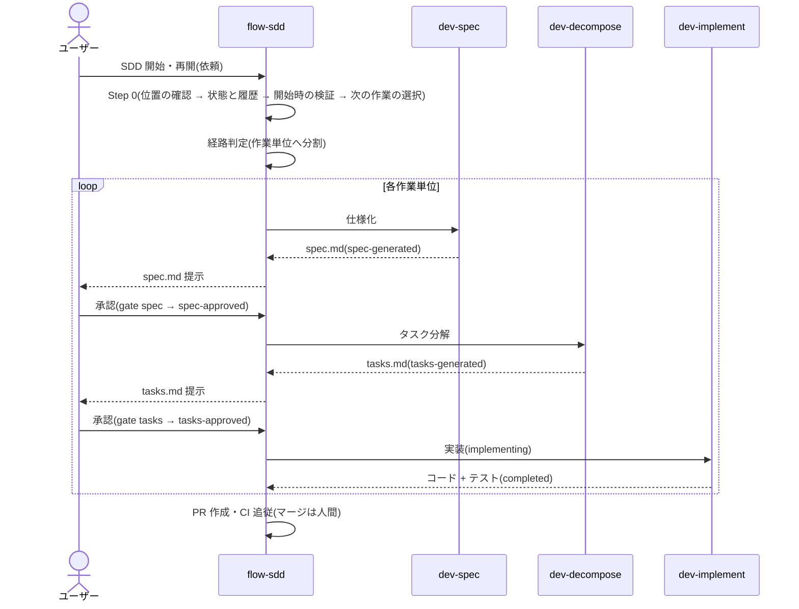

# dev スキル群 構成(DESIGN)

> 現状の構造を表す生成物。`meta-doc` がスキルの定義(SSoT)から生成し、更新時は全上書きする。設計判断の根拠・履歴は [decisions/](./decisions/README.md)(`D-###`)にある。構成の詳細の正本は各 SKILL.md・スクリプトの docstring・`workflow.json` であり、本書と差異がある場合はそれらを正とする。

## 概要

`dev-skills` は汎用の開発スキル群である。SSoT をソースコードに置き(コードが SSoT、仕様は実装までの中間生成物)、単機能の部品スキルと、それを状態機械で束ねる composition で構成する。依存はオニオン型に外側から内側への一方向に限る(レイヤー 0: foundation 〜 レイヤー 3: extension)。SDD はこの部品群から組み立てる composition の一つ(flow-sdd)である。

これと直交する軸として、スキル群**自体**を構成するドキュメント(SKILL・references・templates・agents・scripts・`.meta`)の品質を担保する meta 分類(`meta-*`)を持つ。配布するスキルは用途グループ(`dev`・`writing`・`authoring`)に置き、配布しない `meta-*` は `.claude/skills` に置く(D-011)。利用側はグループを選んで導入できる(D-012)。グループの機構である port のサンプル(`dev/ports`)と拡張バンドル(`dev/extensions`)はグループ配下に置き、`skills/`・`agents/` の外にあるため配布されない(D-014)。meta 分類も同じくレイヤー構造をとる(レイヤー 0: meta-core / レイヤー 1: meta-check・meta-review・meta-doc)。

レイヤー 3(extension)は、個別具体的なパターンでのみ要求される拡張と、汎用だが harness の機構(hooks・`settings.json`・MCP)に依存する拡張を収める。後者は本体がその機構に依存しない規律のために拡張へ置く。現在の収録物はバンドル群 `guardrails` の `ext-dev-guardrails`(安全制約を hook で強制する。D-018)である。

導入・削除は展開スクリプト `install.py` が用途グループの `skills/*`・`agents/*` を利用側の `.claude/` へハードコピーして行う(グループ外の `meta-*` は配布しない。グループ名を指定すればその群だけを導入する。利用側の明示操作)。拡張バンドルは `install.py ext` で個別に導入し、`settings.snippet.json` の hooks を利用側の `settings.json` へ冪等マージする。

設計判断の根拠は D-000(初版設計の全体像)・D-001(スキル群自体の品質と DESIGN 2 層分離)・D-004(本書のテンプレート化と全上書き方針)・D-005(品質の対象の呼称)・D-006(導入をハードコピーにし meta-* を配布しない)・D-007(多段オーケストレーションの禁止対象をエージェント主導に限定)・D-008(配布する部品をモデル自動起動の対象に置いたままにする)・D-009(恒久情報の配置に用語集を追加)・D-010(スクリプトの単体テストを tests/ に置き配布しない)・D-011(配布するスキルを `.claude` の外の用途グループへ置く)・D-012(汎用スキルを用途ごとのグループへ置き、グループ単位で導入する)・D-013(グループ固有の規約を宣言ファイルへ外出しする)・D-014(port と拡張バンドルをグループ配下へ移す)・D-015(参照を常時と条件付きに分ける)・D-016(サブエージェント・プロンプトで指示とデータを構造で区別する)・D-017(圧縮後の再開をファイルからの再導出で担保する)・D-018(決定論的強制を hook 拡張バンドルとして配る)・D-019(検証手段の 3 方式を対応づける)・D-020(再開手順の固定と巻き戻し手段)・D-021(完了判定の偽陽性への対策)・D-022(自走と headless をレイヤー 3 に閉じ dev-author をコアから外す)・D-023(棚卸しで維持と決めた構成要素)・D-024(workdir のディレクトリ名に連番を付け、採番をエンジンが行う)を参照。

## 原則

スキル群自体の品質担保の設計原則。正本は [principles.md](../.claude/skills/meta-core/references/principles.md) で、本節はその要約である。

- **2 つの品質の対象(対象レベル / メタレベル)**: 生成する成果物(spec.md 等 = 成果物の品質)と、スキル群自体を構成するドキュメント(SKILL・references・templates・scripts・`.meta` 等 = スキル群自体の品質)を分けて担保する。前者は dev 分類(check.py・文書ゲート)、後者は meta 分類(`meta-*`)が担う。後者は前者のメタレベル(同じ品質哲学の自己適用)。層 0/1/2 とは別軸(D-005)。
- **SSoT はスキルの定義**: 実際に実行される定義(各グループの `skills/`・`agents/` と `workflow.json`)がスキル群の唯一の正本。DESIGN.md 等の俯瞰文書はその導出物で、食い違えばスキルの定義を正とする(「コードが SSoT、説明は導出」の自己適用)。
- **DESIGN の 2 層分離**: 現状の構造は DESIGN.md(生成・全上書き)、判断の根拠・履歴は `decisions/`(手書き)。DESIGN.md は判断を持たず `D-###` で参照する(D-004)。
- **依存規律(一方向)**: `dev-*`/`flow-*`/`ext-*` は `meta-*` を参照しない。`meta-*` が対象を走査・検査・生成するのは一方向(`meta-*` → 対象)。スキル群自体の品質に固有の観点は `meta-core` に置き `dev-core` に混ぜない。
- **`meta-*` の構成**: `meta-core`(原則・観点・スクリプトの正本)+ `meta-check`(機械検査)+ `meta-review`(観点レビュー)+ `meta-doc`(DESIGN 生成)。
- **グループ固有の規約は宣言で与える**: 部品名らしさ・状態名らしさ・レイヤーの割り当てはグループ直下の `group.json` が宣言し、宣言を持たないグループは既定で成立する。`meta-*` は特定のグループの構造を前提にしない(D-013)。グループの機構(port のサンプル・拡張バンドル)もグループ配下に置き、`meta-*` は固定パスではなく各グループ配下を走査する(D-014)。

## 構成要素

各グループのスキル・スクリプト・エージェント(役割の正本は各 SKILL.md の frontmatter・スクリプトの docstring)。レイヤー 3 の拡張バンドルは配布対象の外にあるため `meta_extract.py` の抽出には現れず、本表では出典を明記して列挙する。

| 分類 | レイヤー | 種別 | 名前 | 役割 |
| ---- | -------- | ---- | ---- | ---- |
| dev | 0 | スキル | dev-core | 基盤。記法規約・恒久情報配置・オーケストレーション・検証手段の選択等の共有リファレンス群 + 決定論スクリプト(参照専用) |
| dev | 1 | スキル | dev-spec | サブ部品。壁打ちで公開インターフェース・データ構造の契約と EARS 受け入れ基準を spec.md 1 本に確定 |
| dev | 1 | スキル | dev-decompose | サブ部品。spec.md を実装タスク(tasks.md)へ分解し File Structure Plan を立てる |
| dev | 1 | スキル | dev-implement | コア部品。tasks.md をもとに TDD 実装(implementer/reviewer/debugger 協調) |
| dev | 1 | スキル | dev-release | コア部品。出荷可否判定(GO/NO-GO)とリリース計画 |
| dev | 1 | スキル | dev-check | オプション部品。read-only の整合性検査 |
| dev | 2 | スキル | flow-sdd | composition。SDD ワークフロー(spec→decompose→implement を承認ゲート付き状態機械で駆動。状態機械定義は workflow.json) |
| dev | 3 | スキル | ext-dev-guardrails | 拡張。安全制約(破壊的な git 操作・一括ステージング・凍結済み中間生成物の変更)を hook で強制する。バンドル群 `guardrails`。出典: `../dev/extensions/guardrails/ext-dev-guardrails/SKILL.md` |
| dev | 3 | フック | ext-dev-guardrails/hooks/guard_bash.py | PreToolUse(Bash)。破壊的な git 操作と一括ステージングを拒否する。出典: `../dev/extensions/guardrails/ext-dev-guardrails/hooks/guard_bash.py` |
| dev | 3 | フック | ext-dev-guardrails/hooks/guard_write.py | PreToolUse(Write / Edit / MultiEdit / NotebookEdit)。凍結済み中間生成物への書き込みを拒否する。出典: `../dev/extensions/guardrails/ext-dev-guardrails/hooks/guard_write.py` |
| dev | 0 | エージェント | dev-implementer | 役割エージェント。1 タスクの TDD 実装 |
| dev | 0 | エージェント | dev-debugger | 役割エージェント。失敗タスクの根本原因の切り分けと最小修正 |
| dev | 0 | エージェント | dev-reviewer | 役割エージェント。敵対的判定器(文書ゲート・コード検証。観点別に並列起動) |
| dev | 0 | エージェント | dev-explorer | 役割エージェント。read-only 調査(ダイジェストのみ返す) |
| dev | 0 | スクリプト | dev-core/scripts/state.py | 汎用状態機械エンジン(init/set-state/approve/show/status/scan・workdir の採番・凍結) |
| dev | 0 | スクリプト | dev-core/scripts/check.py | 成果物の静的チェッカ(状態・spec.md・tasks.md の規約検査) |
| dev | 0 | スクリプト | dev-core/scripts/lib.py | state.py・check.py 共通ロジック(定義検証・パース・凍結) |
| dev | 0 | スクリプト | dev-core/scripts/ports.py | 知識 port の frontmatter 走査(inject 判定) |
| writing | 1 | スキル | japanese-writing | 日本語の開発ドキュメント・技術文書の作成規範(層別の references + 検査スクリプト) |
| writing | 1 | スクリプト | japanese-writing/scripts/lint.py | AI 臭い日本語の決定論的検出 |
| writing | 1 | スクリプト | japanese-writing/scripts/outline.py | 文書のスケルトン(見出し・段落の先頭文・箇条書き)の抽出 |
| writing | 1 | スクリプト | japanese-writing/scripts/terms.py | 専門用語候補の初出順抽出 |
| writing | 1 | スクリプト | japanese-writing/scripts/semantic.py | 文埋め込みによる話題の平板さの検出(実験・任意) |
| writing | 1 | スクリプト | japanese-writing/scripts/textcore.py | 検査スクリプト共通の本文抽出 |
| authoring | 1 | スキル | skill-authoring | スキル(SKILL.md と参照ファイル)を新規作成・編集・リファクタするときの設計規範 |
| meta | 0 | スキル | meta-core | 基盤(メタ)。スキル群自体の品質担保の設計原則(principles.md)・観点カタログ(doc-perspectives.md)+ スクリプト(参照専用) |
| meta | 1 | スキル | meta-check | スキル群の機械的整合検査(read-only) |
| meta | 1 | スキル | meta-review | 観点カタログによる意味レビュー(read-only) |
| meta | 1 | スキル | meta-doc | 本書(DESIGN.md)をスキルの定義から生成 |
| meta | 0 | スクリプト | meta-core/scripts/meta_check.py | スキル群自体の機械的整合検査(参照実在・依存規律・状態整合等) |
| meta | 0 | スクリプト | meta-core/scripts/meta_lib.py | meta-* スクリプトの共通ロジック(frontmatter の YAML サブセット解析・スキル群の配置の走査・グループ規約の読み込み) |
| meta | 0 | スクリプト | meta-core/scripts/meta_extract.py | DESIGN.md 生成用の構造抽出(部品・状態機械・inject・エージェント) |
| meta | 0 | スクリプト | meta-core/scripts/meta_loc.py | スキル群のコード行数の集計(領域ごと・種別ごと・read-only) |
| meta | 0 | スクリプト | meta-core/scripts/trigger_check.py | description のトリガ検査(肯定例・near-miss 否定例・近接衝突・read-only) |

## 相関図

### レイヤー構造

dev 分類・meta 分類はともにオニオン型のレイヤー構造をとり、依存は外側から内側への一方向(ネストした subgraph が内包 = 外側が内側を知り、内側は外側を知らないことを表す)。writing 分類・authoring 分類は単独のスキルで、レイヤー構造も相互の依存も持たない。meta 分類は配布する分類と直交し、対象を一方向に走査・生成する(破線)。

### DFD

依頼から出荷までのデータの流れ。図形と線種の意味は図中の凡例に示す。

## 処理シーケンス

### flow-sdd

依頼を経路判定して作業単位に分け、各単位を仕様→分解→実装の順に承認ゲート付きで駆動する。承認はすべて人間。セッションの開始時は、記憶ではなくファイル(state.json・tasks.md・git ログ)から現在地を再導出する(D-020)。

